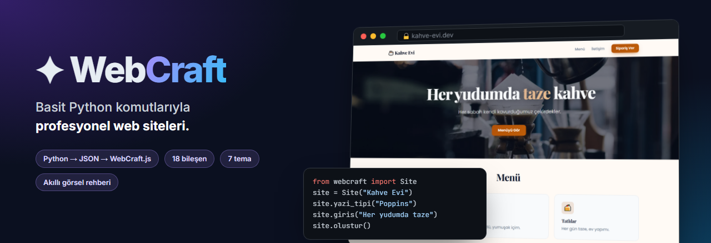
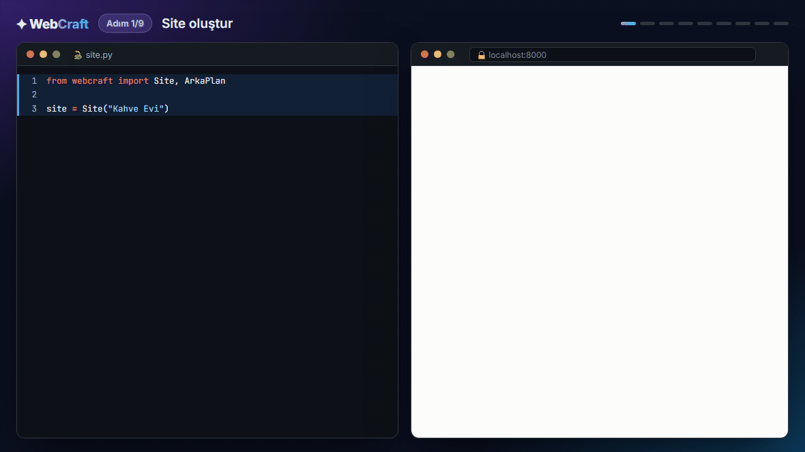
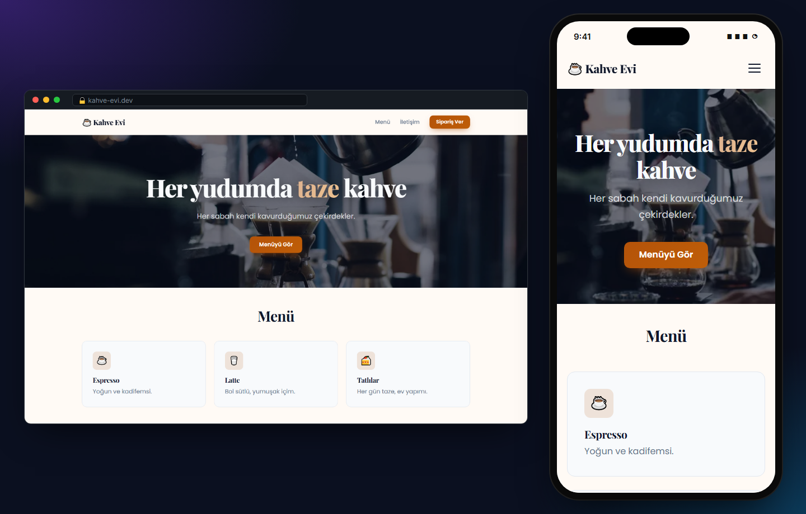
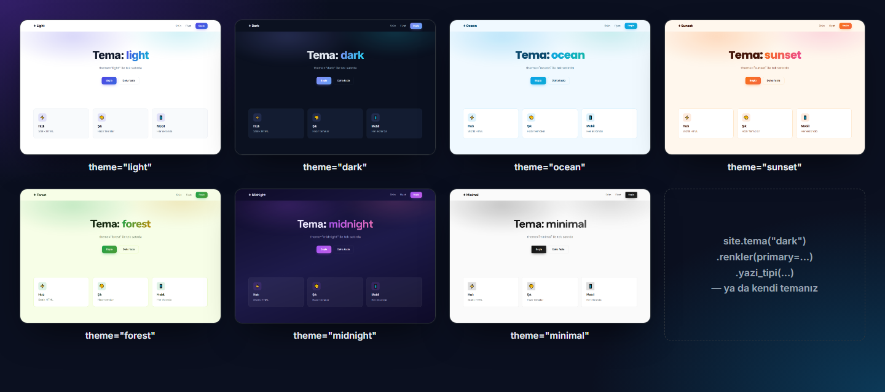
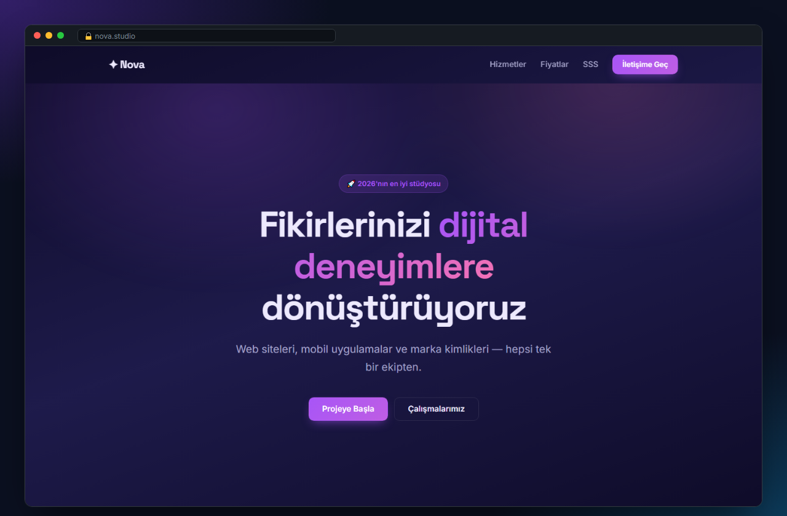
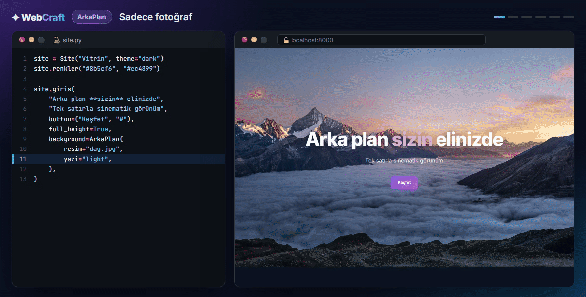
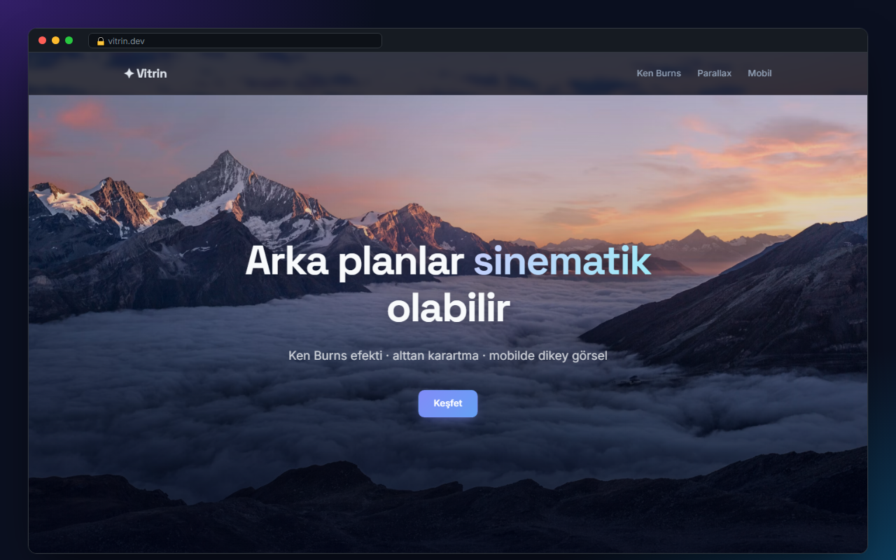
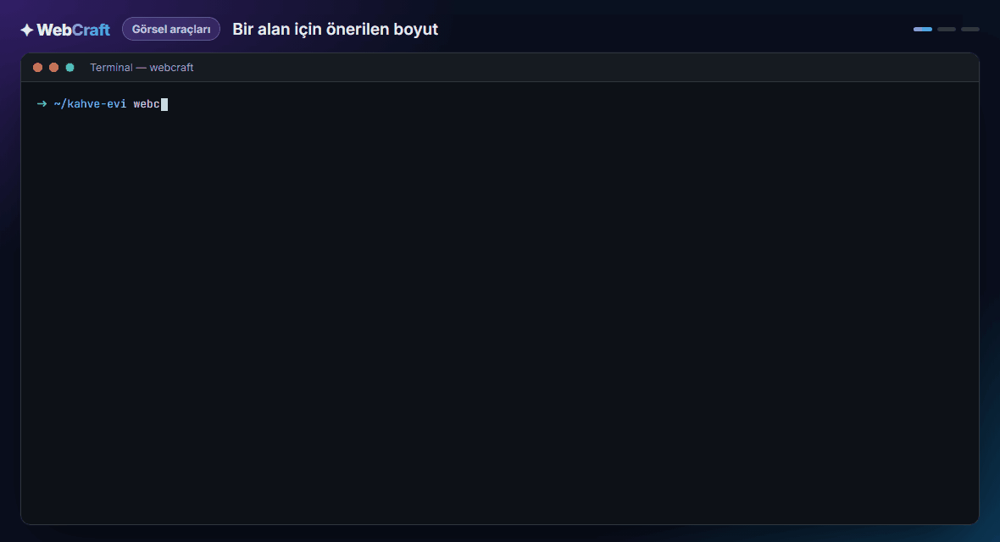
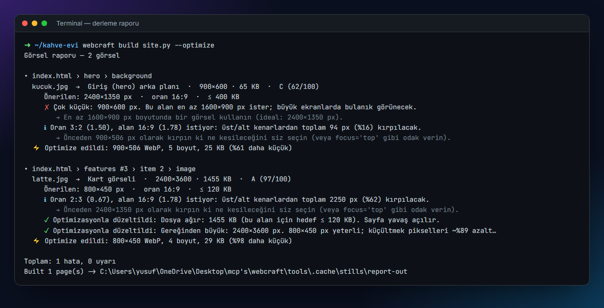

<p align="center">
  
</p>

<p align="center">
  
  
  
  
  
</p>

<p align="center">
  <a href="#-30-saniyede-başlayın">Başlangıç</a> ·
  <a href="#-nasıl-çalışır">Nasıl çalışır?</a> ·
  <a href="#-temalar">Temalar</a> ·
  <a href="#-arka-planlar">Arka planlar</a> ·
  <a href="#-akıllı-görsel-rehberi">Görsel rehberi</a> ·
  <a href="#-bileşenler">Bileşenler</a> ·
  <a href="#-komut-satırı">CLI</a>
</p>

---

**WebCraft**, web sitesini Python ile *tarif etmenizi* sağlar: `site.arka_plan(...)`, `site.yazi_tipi(...)`, `site.giris(...)`.
Gerisini — modern tasarım, mobil uyum, animasyonlar, görsel optimizasyonu, SEO — kütüphane halleder.
Sonuç, her yere yüklenebilen **statik** bir sitedir.

<p align="center">
  
  <br><sub><b>Adım adım:</b> her satır sitenin bir parçasını ekliyor — menü, giriş, font, renk, arka plan fotoğrafı, kartlar.</sub>
</p>

## ✨ Öne çıkanlar

| | |
|---|---|
| 🐍 **Basit Python komutları** | Türkçe (`yazi_tipi`, `arka_plan`) veya İngilizce (`font`, `background`) — ikisi de aynı |
| 🎨 **7 hazır tema + kendi temanız** | Renk, font (tüm Google Fonts), köşe, genişlik tek satırda |
| 🧩 **18 bileşen** | Menü, giriş, kartlar, sayaçlar, galeri, yorumlar, fiyatlar, SSS, form, sütunlar… |
| 🖼️ **Sinematik arka planlar** | Fotoğraf + karartma, bulanıklık, siyah-beyaz, parallax, Ken Burns, mobil için ayrı görsel |
| 📐 **Akıllı görsel rehberi** | Her alan için piksel/oran/dosya boyutu tavsiyesi, otomatik kalite raporu, "bu foto nereye uygun?" |
| ⚡ **Otomatik optimizasyon** | Odak noktasına göre kırpma, WebP, ekrana göre boyut (srcset), LCP preload |
| 📱 **Mobil uyumlu** | Her bileşen telefonda kusursuz; hamburger menü dahil |
| 🔎 **SEO hazır** | Open Graph / Twitter kartı, canonical, tema rengi, favicon |
| 📦 **Sıfır bağımlılık** | Sadece Python standart kütüphanesi (optimizasyon için isteğe bağlı Pillow) |

## 🚀 30 saniyede başlayın

```bash
git clone https://github.com/EthYusuf/webcraft.git
cd webcraft
pip install -e .            # görsel optimizasyonu için:  pip install -e .[images]
```

```python
from webcraft import Site, ArkaPlan

site = Site("Kahve Evi")
site.yazi_tipi("Poppins", heading="Playfair Display")   # Google Fonts otomatik yüklenir
site.renkler(primary="#b45309", secondary="#d97706")
site.arka_plan("#fffaf5")

site.menu("☕ Kahve Evi", {"Menü": "#menu", "İletişim": "#iletisim"}, cta=("Sipariş Ver", "#iletisim"))
site.giris("Her yudumda **taze** kahve",                # **...** → gradyan vurgu
           "Her sabah kendi kavurduğumuz çekirdekler.",
           button=("Menüyü Gör", "#menu"),
           background=ArkaPlan(resim="kahve.jpg", karartma="dark", yazi="light"))
site.kartlar([
    ("☕", "Espresso", "Yoğun ve kadifemsi."),
    ("🥛", "Latte", "Bol sütlü, yumuşak içim."),
    ("🍰", "Tatlılar", "Her gün taze, ev yapımı."),
], title="Menü", id="menu")
site.alt_bilgi("© 2026 Kahve Evi")

site.yayinla()      # derle + http://localhost:8000 aç
# site.olustur()    # sadece dist/ klasörüne derle
```

Yukarıdaki kodun çıktısı — masaüstü ve telefonda:

<p align="center"></p>

## 🧠 Nasıl çalışır?

```
 site.py (Python)                 dist/ (statik dosyalar)                 Tarayıcı
 ─────────────────                ───────────────────────                ─────────
 site.giris(...)      build()     index.html                              WebCraft.js
 site.kartlar(...)  ─────────►    ├─ <script type=application/json>  ──►  JSON'u okur,
 site.arka_plan(...)              │    { tema, bileşenler }               DOM'u kurar,
                                  ├─ assets/webcraft.js / .css            tema + animasyon +
   görsel analizi ✓               └─ assets/media/*.webp                  parallax uygular
```

1. **Python** siteyi *tarif eder*: hangi bileşenler, hangi sırada, hangi renk/font/görsellerle. Görselleri kullanıldıkları yere göre kontrol eder, kopyalar veya optimize eder ve tarifi JSON olarak HTML'e gömer.
2. **WebCraft.js** sayfa açılınca bu JSON'u okuyup siteyi **tarayıcıda kurar**. Temayı ilk boyamadan önce uygular (koyu temalarda beyaz parlama olmaz), ardından fontları, animasyonları, sayaçları, parallax/Ken Burns efektlerini ve mobil menüyü çalıştırır, ekrana uygun görsel boyutunu seçer.
3. Sonuç tamamen **statik**: sunucuda Python çalışmaz. `dist/` klasörünü GitHub Pages, Netlify, Vercel veya herhangi bir hostinge yükleyebilirsiniz.

## 🎨 Temalar

```python
site = Site("Benim Sitem", theme="midnight")      # light · dark · ocean · sunset · forest · midnight · minimal
site.tema("dark").renkler(primary="#f43f5e").yazi_tipi("Space Grotesk").kose(4)
```

<p align="center"></p>

| Türkçe | English | Örnek |
|---|---|---|
| `tema` | `theme` | `site.tema("dark")` |
| `arka_plan` | `background` | `site.arka_plan("#0b1120")` · `site.arka_plan("linear-gradient(135deg,#667eea,#764ba2)")` · `site.arka_plan(image="bg.jpg", overlay="dark")` |
| `yazi_tipi` | `font` | `site.yazi_tipi("Inter", heading="Playfair Display", size=18)` |
| `renkler` | `colors` | `site.renkler(primary="#e11d48", secondary="#f59e0b", text="#111")` |
| `yazi_rengi` | `text_color` | `site.yazi_rengi("#222")` |
| `ana_renk` | `primary_color` | `site.ana_renk("#16a34a")` |
| `kose` | `radius` | `site.kose(0)` — keskin köşeler |
| `genislik` | `width` | `site.genislik(1280)` |

Tüm komutlar zincirlenebilir. `**kalın**`, `*italik*`, `` `kod` `` ve `[link](url)` tüm yazılarda çalışır.

<p align="center">
<br><sub><code>examples/landing.py</code> — menü, istatistik, hizmet kartları, galeri, yorumlar, fiyatlar, SSS ve iletişim formuyla tam bir ajans sitesi.</sub></p>

## 🖼️ Arka planlar

Arka plan düz renk, gradyan veya **fotoğraf** olabilir. Fotoğraf ve karartma ayrı katmanlarda çizilir; bulanıklık gibi filtreler **yazıyı asla etkilemez**.

<p align="center">
  
</p>

```python
site.giris("Başlık", background=ArkaPlan(
    resim="dag.jpg",              # dosya yolu veya URL
    mobil_resim="dag-dikey.jpg",  # 768 px altı ekranlarda bu kullanılır
    konum="orta alt",             # görünen kısım — veya (30, 70) = %30 soldan, %70 üstten
    karartma="bottom",            # dark darker light top bottom vignette primary brand · veya CSS
    bulaniklik=3, parlaklik=0.9,  # blur, brightness, contrast, saturate, grayscale
    hareket="kenburns",           # kenburns (yavaş yakınlaşma) | parallax (kaydırma efekti)
    yazi="light",                 # üstteki yazıları açık renge çevirir
))

with site.bolum("Başlık", background=Background(image="ofis.jpg", motion="parallax",
                                                 overlay="vignette", text="light"), padding=140) as b:
    b.yazi("Bölüm, herhangi bir bileşen ya da tüm sayfa aynı arka plan seçeneklerini kullanır.")
```

<details>
<summary><b>Tüm arka plan seçenekleri</b></summary>

| Seçenek | Türkçe | Değerler |
|---|---|---|
| `image` | `resim` | dosya yolu / URL |
| `mobile_image` | `mobil_resim` | dikey görsel (1080×1920 önerilir) |
| `position` / `mobile_position` | `konum` / `mobil_konum` | `"center"`, `"top"`, `"left bottom"`, `"orta üst"`, `(x%, y%)` |
| `size` | `boyut` | `cover` / `kapla`, `contain` / `sigdir`, `auto`, `1200`, `"50%"` |
| `repeat` | `tekrar` | `True` (desen/doku için) |
| `fixed` | `sabit` | `True` → kaydırırken sabit durur (mobilde otomatik kapanır) |
| `overlay` | `karartma` | `dark`, `darker`, `light`, `top`, `bottom`, `vignette`, `primary`, `brand`, CSS renk/gradyan |
| `overlay_opacity` | `opaklik` | 0–1 |
| `blur`, `brightness`, `contrast`, `saturate`, `grayscale` | `bulaniklik`, `parlaklik`, `kontrast`, `doygunluk`, `siyah_beyaz` | sayılar |
| `motion` | `hareket` | `kenburns`, `parallax` (+ `parallax_speed`) |
| `text` | `yazi` | `light`, `dark` veya renk |
| `color`, `gradient` | `renk`, `gradyan` | görselin arkasındaki yedek renk / gradyan |
| `min_height` | `min_yukseklik` | `600` veya `"80vh"` |
| `focus` | `odak` | optimizasyonda kırpma odağı (varsayılan: `position`) |
| `alt` | `aciklama` | ekran okuyucular için açıklama |

</details>

<p align="center">
<br><sub><code>examples/backgrounds.py</code> — Ken Burns, parallax, marka kaplaması, sabit arka plan ve mobil görsel tek sayfada.</sub></p>

## 📐 Akıllı görsel rehberi

WebCraft her görselin **nerede kullanıldığını** bilir. Her alanın kendi önerilen piksel boyutu, en-boy oranı, dosya boyutu sınırı ve kompozisyon tavsiyesi vardır. Değerler retina (2x) ekranlar için hesaplanmıştır.

| Alan | Önerilen | En az | Oran | Maks. dosya |
|---|---|---|---|---|
| Sayfa arka planı (`page_background`) | 2560×1440 px | 1920×1080 px | 16:9 | 450 KB |
| Giriş (hero) arka planı (`hero_background`) | 2400×1350 px | 1600×900 px | 16:9 | 400 KB |
| Giriş yan görseli (`hero_image`) | 1200×900 px | 800×600 px | 4:3 | 250 KB |
| Bölüm arka planı (`section_background`) | 1920×800 px | 1440×600 px | 12:5 | 300 KB |
| Mobil arka plan (`mobile_background`) | 1080×1920 px | 750×1334 px | 9:16 | 250 KB |
| İçerik görseli (`content_image`) | 1920×1080 px | 1100×620 px | 16:9 | 300 KB |
| Sütun görseli (`column_image`) | 1200×900 px | 800×600 px | 4:3 | 200 KB |
| Kart görseli (`card_image`) | 800×450 px | 640×360 px | 16:9 | 120 KB |
| Galeri görseli (`gallery`) | 1200×900 px | 800×600 px | 4:3 | 220 KB |
| Profil fotoğrafı (`avatar`) | 256×256 px | 96×96 px | 1:1 | 40 KB |
| Logo (`logo`) | ↕ 102 px | ↕ 68 px | serbest | 30 KB |
| Site ikonu (`favicon`) | 512×512 px | 180×180 px | 1:1 | 50 KB |
| Paylaşım görseli (`og_image`) | 1200×630 px | 600×315 px | 1.91:1 | 300 KB |
| Video kapak görseli (`video_poster`) | 1920×1080 px | 1280×720 px | 16:9 | 250 KB |

Ayrıntılı kompozisyon tavsiyeleri (konuyu nereye koymalı, mobilde ne kırpılır): **[docs/GORSEL-REHBERI.md](docs/GORSEL-REHBERI.md)**

### Elinizdeki görsel nereye uygun, yeterli mi?

<p align="center"></p>

```python
from webcraft import resim_rehberi, resim_analiz, resim_nereye

print(resim_rehberi("kart"))                       # kart görseli kaç piksel olmalı?
print(resim_analiz("foto.jpg", "hero_background")) # bu foto hero için yeterli mi?
for p in resim_nereye("foto.jpg"):                 # bu foto en çok nereye uyar?
    print(p)
```

### Derlerken otomatik rapor

`site.olustur()` sitedeki **her görseli kullanıldığı yere göre** kontrol eder ve A–F notu verir: çok küçük mü, kaç piksel kırpılacak (ve önerilen kırpma ölçüsü), dosya ağır mı, format uygun mu, fotoğraf yan mı dönmüş…

<p align="center"></p>

```python
site.olustur(optimize_images=True)   # kırp + WebP + srcset — düzeltilen sorunlar ✓ olarak işaretlenir
site.olustur(strict=True)            # görsel hatası varsa derleme durur (CI için)
site.olustur(check_remote=True)      # URL görsellerini de indirip kontrol et
print(site.resim_raporu())           # derlemeden sadece rapor
```

`optimize_images=True` (Pillow gerekir) sırasıyla şunları yapar: EXIF yönünü piksellere uygular → görseli alanın oranına **odak noktasına göre** kırpar → önerilen boyutu aşmayan WebP sürümleri üretir (320w … 2560w) → sayfaya `srcset` ve `width/height` yazar (sayfa kaymaz) → ilk ekrandaki görseli önceden yükletir.

### Görsel bileşeni ve SEO

```python
site.resim("urun.jpg", "Ürün", width=480, aspect="1:1", position="top", link="https://...", caption="...")

Site("Başlık", description="...", og_image="paylasim.jpg",    # 1200×630 önerilir
     favicon="ikon.svg", url="https://alanadi.com", theme_color="#0b1120")
```

`aspect` görseli o orana kırpar ve rapor o orana göre değerlendirir; `position` hangi kısmın görüneceğini seçer; `width` verilince önerilen dosya genişliği `2 × width` olur.

## 🧩 Bileşenler

| Türkçe | English | Ne yapar |
|---|---|---|
| `menu` | `navbar` | Yapışkan menü, mobilde hamburger |
| `giris` | `hero` | Büyük başlık alanı (rozet, butonlar, yan görsel veya arka plan fotoğrafı) |
| `baslik` / `yazi` / `buton` | `heading` / `text` / `button` | Temel içerik |
| `resim` / — | `image` / `video` | Görsel (oran, odak, link), YouTube/Vimeo/MP4 |
| `ozellikler` / `kartlar` | `features` / `cards` | İkonlu veya görselli kart ızgarası |
| `istatistikler` | `stats` | Sayarak artan sayaçlar |
| `galeri` | `gallery` | Görsel ızgarası |
| `yorumlar` | `testimonials` | Müşteri yorumları |
| `fiyatlar` | `pricing` | Fiyat tablosu |
| `sss` | `faq` | Açılır soru-cevap |
| `cagri` | `cta` | Renkli çağrı bandı |
| `iletisim` | `contact` | İletişim formu (mailto veya Formspree `action=`) |
| `bolum` | `section` | Kendi arka planı olan grup (`with` ile) |
| `sutunlar` | `columns` | Yan yana sütunlar (`with` ile) |
| `ayrac` / `bosluk` | `divider` / `spacer` | Boşluk düzenleme |
| — | `html` | Ham HTML |
| `alt_bilgi` | `footer` | Alt bilgi, linkler, sosyal medya |

Her bileşen ortak seçenekleri kabul eder: `id`, `background` (renk, gradyan veya `ArkaPlan`), `color`, `padding`, `align`, `animate` (`fade-up`, `fade-left`, `zoom`, `False`…), `class_`, `style`.

```python
with site.bolum(background="#111827", color="#fff", padding=100) as b:
    b.baslik("Koyu bölüm", align="center")
    b.yazi("İçerik...", align="center")

with site.sutunlar(2) as (sol, sag):
    sol.resim("foto.jpg")
    sag.baslik("Hakkımızda").yazi("...")

hakkinda = site.sayfa("hakkinda", title="Hakkımızda")   # → hakkinda.html
hakkinda.menu("Logo", {"Ana Sayfa": "index.html"}).baslik("Hakkımızda", level=1)
```

## 💻 Komut satırı

```bash
webcraft new projem                          # projem/site.py başlangıç şablonu
webcraft build projem/site.py                # → projem/dist/
webcraft build site.py --inline              # her sayfa tek dosya (CSS+JS gömülü)
webcraft build site.py --optimize --strict   # görselleri optimize et, hata varsa dur
webcraft serve site.py -p 8080               # derle + yerel sunucu

webcraft check site.py                       # sitedeki tüm görsellerin raporu
webcraft guide                               # tüm alanların boyut rehberi (--lang en)
webcraft check-image foto.jpg                # bu görsel nereye uygun?
webcraft check-image foto.jpg -s kart        # kart görseli olarak yeterli mi?
webcraft optimize foto.jpg -s hero --focus top -o out/
```

`webcraft` komutu PATH'te değilse `python -m webcraft ...` kullanın.

## 🟨 WebCraft.js'i doğrudan JavaScript ile kullanmak

```html
<link rel="stylesheet" href="webcraft.css">
<div id="app"></div>
<script src="webcraft.js"></script>
<script>
  WebCraft.site("JS Sitesi")
    .theme("ocean").font("Poppins")
    .hero({ title: "Merhaba **JS**", buttons: [{ text: "Başla", href: "#" }],
            background: { image: "dag.jpg", overlay: "bottom", motion: "kenburns", text: "light" } })
    .features({ items: [{ icon: "⚡", title: "Hızlı", text: "..." }] })
    .mount("#app");

  // Kendi bileşeninizi ekleyin — Python'dan site.add("rozet", {...}) ile kullanılabilir
  WebCraft.register("rozet", (p) => WebCraft.utils.h("div", { class: "wc-badge" }, p.text));
</script>
```

## 📂 Örnekler

```bash
python examples/minimal.py                # 10 satırlık site
python examples/landing.py                # tam bir ajans açılış sayfası
python examples/backgrounds.py            # tüm arka plan seçenekleri
python examples/image_check.py foto.jpg   # görsel rehberi ve analiz
```

## 🛠️ Geliştirme

```bash
pip install -e .[dev]
pytest                          # 29 test

pip install pygments
python tools/make_media.py      # README'deki tüm GIF ve ekran görüntülerini yeniden üretir
```

README'deki görsellerin hepsi gerçek WebCraft derlemelerinden, headless Chrome/Edge ile [tools/make_media.py](tools/make_media.py) tarafından üretilir.

## 📄 Lisans

MIT · Görsellerdeki fotoğraflar [Unsplash](https://unsplash.com) lisansıyla kullanılmıştır.
